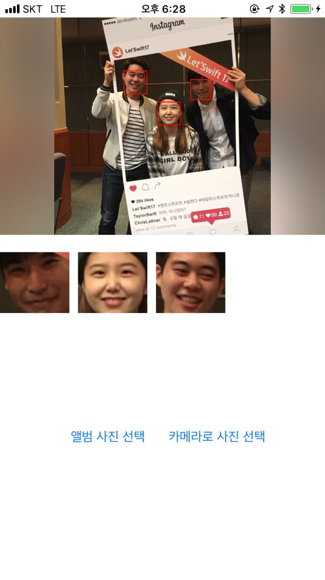

# FacialAnalysis

**얼굴인식 기능 - VNDetectFaceRectanglesRequest**

### 사진에 있는 얼굴 인식하기
*VNDetectFaceRectanglesRequest에 CIImage를 주고 인식값 [VNFaceObservation]로 받습니다.*

```swift
func detectFaces(image: CIImage) {

       let request = VNDetectFaceRectanglesRequest() { request, error in
           guard let faceResults = request.results as? [VNFaceObservation] else {
               fatalError("unexpected result type from VNCoreMLRequest")
           }

           DispatchQueue.main.async {
               /// 값 받았을 경우 따로 큐를 생성하여 작업
               self.displayUI(facesInfo: faceResults)
           }
       }

       let handler = VNImageRequestHandler(ciImage: image)

       DispatchQueue.global(qos: .userInteractive).async {
         /// global 큐에서 정보 핸들링
           do {
               try handler.perform([request])
           } catch {
               print("error")
           }
       }
   }
```   

- handler를 만들고 결과값을 결정한 뒤 정보를 받습니다.
<br><br>

### VNFaceObservation에 정보 처리
*VNFaceObservation.enumerated를 이용하여 원래 이미지의 정보를 처리합니다.*

```swift
func displayUI(facesInfo: [VNFaceObservation]){
        if let faceImage = self.selectedImage {
            let imageRect = AVMakeRect(aspectRatio: faceImage.size, insideRect: self.selectImage.bounds)
            for (index, face) in facesInfo.enumerated() {

              /// 얼굴 부분 표시하기
                let w = face.boundingBox.size.width * imageRect.width
                let h = face.boundingBox.size.height * imageRect.height
                let x = face.boundingBox.origin.x * imageRect.width
                let y = imageRect.maxY - (face.boundingBox.origin.y * imageRect.height) - h

                let layer = CAShapeLayer()
                layer.frame = CGRect(x: x, y: y, width: w, height: h)
                layer.borderColor = UIColor.red.cgColor
                layer.borderWidth = 1
                self.selectImage.layer.addSublayer(layer)

              /// 얼굴 이미지 가지고와 scrollView에 넣기
                let w2 = face.boundingBox.size.width * faceImage.size.width
                let h2 = face.boundingBox.size.height * faceImage.size.height
                let x2 = face.boundingBox.origin.x * faceImage.size.width
                let y2 = (1 - face.boundingBox.origin.y) * faceImage.size.height - h2
                let cropRect = CGRect(x: x2 * faceImage.scale, y: y2 * faceImage.scale, width: w2 * faceImage.scale, height: h2 * faceImage.scale)

                if let faceCgImage = faceImage.cgImage?.cropping(to: cropRect) {
                    let faceUiImage = UIImage(cgImage: faceCgImage, scale: faceImage.scale, orientation: .up)
                    let faceImage = UIImageView(frame: CGRect(x: 90*index, y: 0, width: 80, height: 80))
                    faceImage.image = faceUiImage
                    faceImage.isUserInteractionEnabled = true

                    self.faceImages.append(faceImage)
                    self.faceScrollView.addSubview(faceImage)
                }
            }

            self.faceScrollView.contentSize = CGSize(width: 90*faceImages.count - 10, height: 80)
        }
    }
```  

- VNFaceObservation.enumerated이용하면 사진의 비율로 값이 리턴되기 때문에 AVMakeRect를 이용하여 정보를 처리하였습니다.
<br><br>


#### 결과화면



- 애플 기본 갤러리의 기능을 따라해 보았습니다.
- 얼굴 사진정보를 DB에 넣고 처리하는 기능을 생각해 봐야겠습니다.
