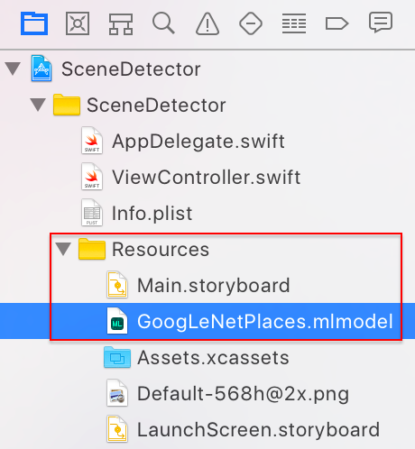
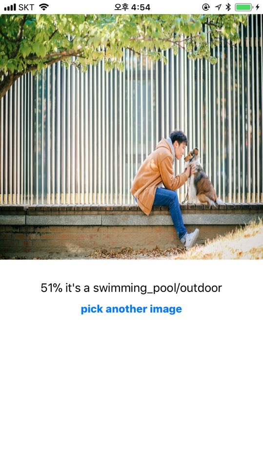

# SceneDetector

####  Machine Learning Model 추가
*GoogleLeNetPlaces model을 추가합니다.*



Apple에서는 이미 학습된 GoogleLeNetPlaces을 제공하여 이를 통해 모델을 추가하면 ```CoreML```, ```Vision```을 추가 할수 있습니다.

- CoreML : 앱에서 숙련된 모델을 보다 쉽게 만들어 줍니다.
- Vision : 얼굴, 얼굴 표식, 텍스트, 사각형, 바코드 및 사물을 감지하는 Apple 모델에 쉽게 접근할수 있습니다.
<br>

#### Vision Model과 CoreML Model 추가
*viewController 내에서 vision, coreML을 쓸수 있도록 wrapping*

```swift
import CoreML
import Vision
```

우선 CoreML과 Vision을 import 받습니다.
<br><br>

*사진을 물어볼수 있는 detectScene(image:) 함수를 구현합니다.*

```swift
extension  {

  func detectScene(image: CIImage) {
     answerLabel.text = "detecing scene..."

     //ML model을 불러옵니다.
     guard let model = try? VNCoreMLModel(for: GoogLeNetPlaces().model) else {
       fatalError("can't load Places ML model")
     }
   }
 }
```

try을 이용하여 ```VNCoreMLModel```을 이용하여 model로 추가한 ```GoogLeNetPlaces```의 모델을 불러옵니다.
<br><br>

*model을 이용하여 request 구현*

```swift
let request = VNCoreMLRequest(model: model) { [weak self] request, error in
      guard let results = request.results as? [VNClassificationObservation],
        let topResult = results.first else {
          fatalError("unexpected result type from VNCoreMLRequest")
      }

      let article = (self?.vowels.contains(topResult.identifier.first!))! ? "an" : "a"

      DispatchQueue.main.async {
        self?.answerLabel.text = "\(Int(topResult.confidence * 100))% it's \(article) \(topResult.identifier)"
      }
}
```

```VNCoreMLRequest```를 이용하여 model 변수에 request를 하고 결과값을 completionHandler를 이용하여 정리합니다.

- 결과값을 [VNClassificationObservation]형태로 가지고 옵니다.
  - **VNClassificationObservation**
    - String : 추론한 이름
    - confidence : 0~1로 정의된 확율
- 상위 이름을 article로 a, an 처리
- answerLabel에 text 설정("처리 시간이 있기때문에 main 큐에서 비동기 처리")
<br><br>

*completionHandler추가와 함수 실행*

```swift
let handler = VNImageRequestHandler(ciImage: image)

   DispatchQueue.global(qos: .userInteractive).async {
     do {
       try handler.perform([request])
     } catch {
       print("error")
     }
   }
```
```handler```를 이용하여 이미지 처리 completionHandler를 만들고 global 큐에서 처리된 이미지값을 request를 통해 view에 보여준다.
<br><br>

*detectScene 함수 실행*

```swift
guard let ciImage = CIImage(image: image) else {
  fatalError("couldn't convert UIImage to CIImage")
}

detectScene(image: ciImage)
```

image를 ```CIImage```로 변환하여 ```detectScene``` 함수를 통해 분석합니다.


#### 결과화면



정확하진 않지만 정확도와 주제가 나오기 때문에 데이터베이스를 설계할때 가장 높은 주제뿐만 아니라 나머지 주제도 참고하여 설계해야 될거 같습니다.
